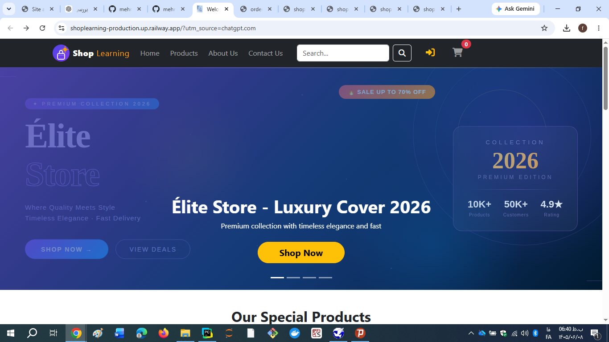
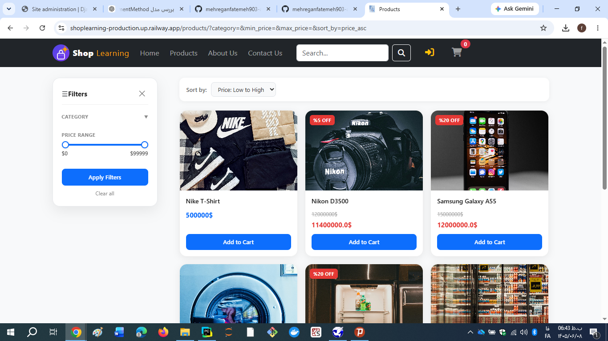
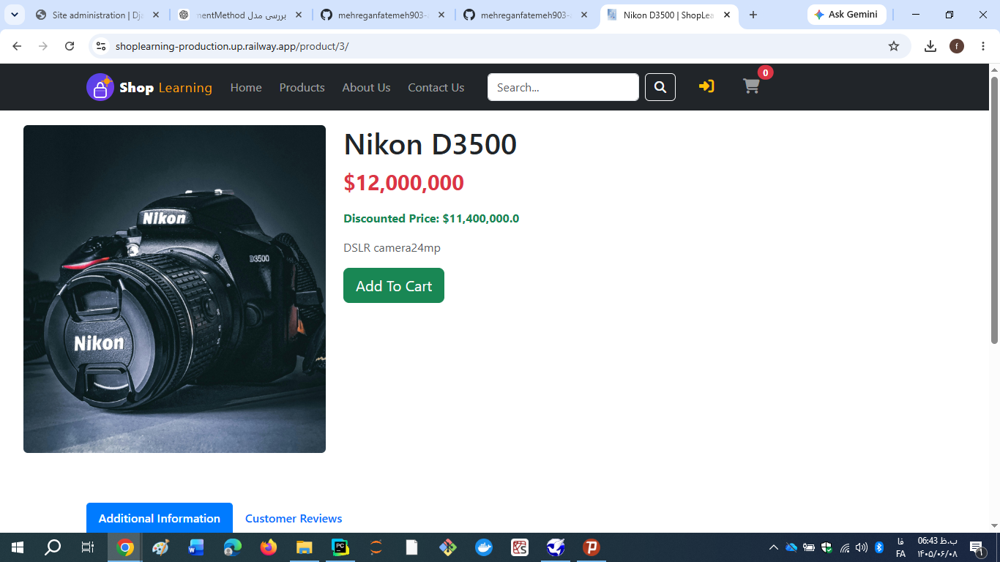
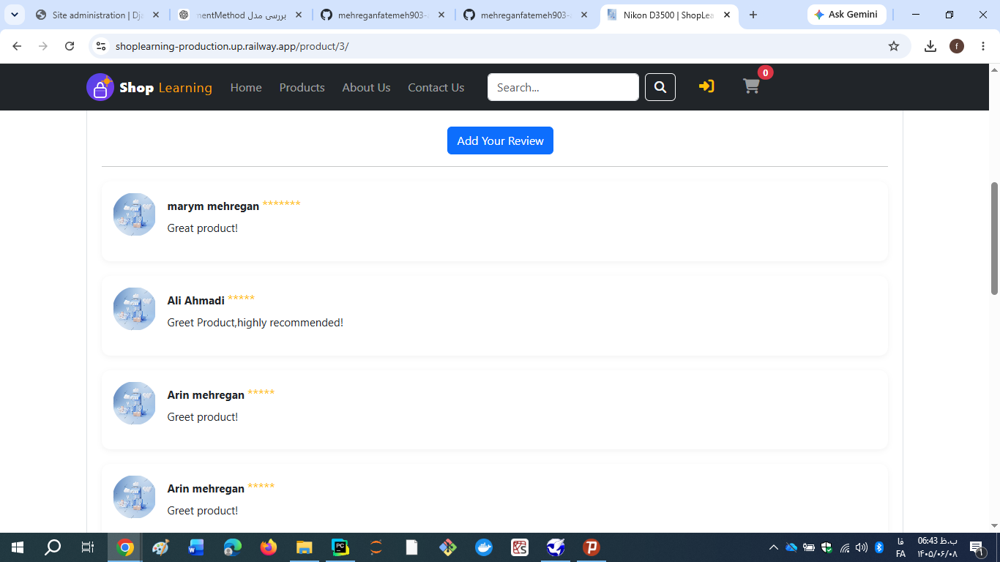
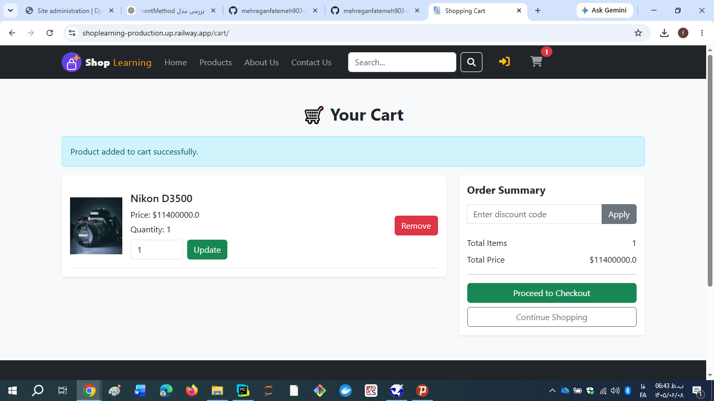
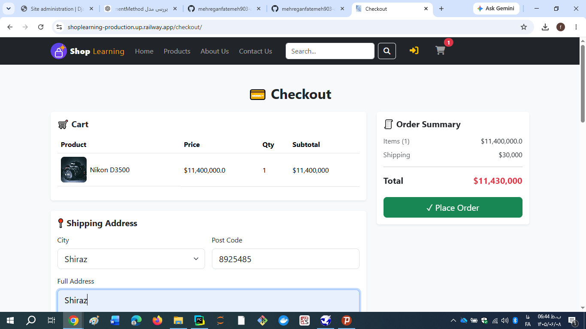
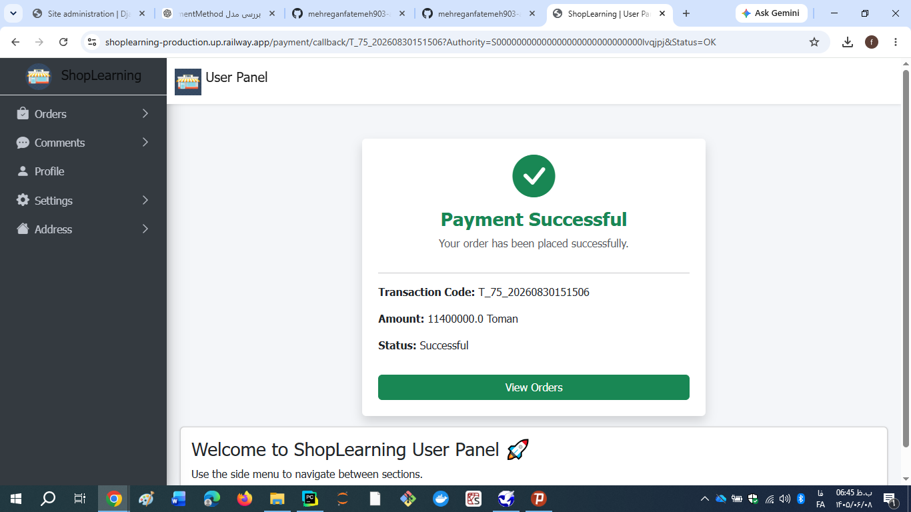
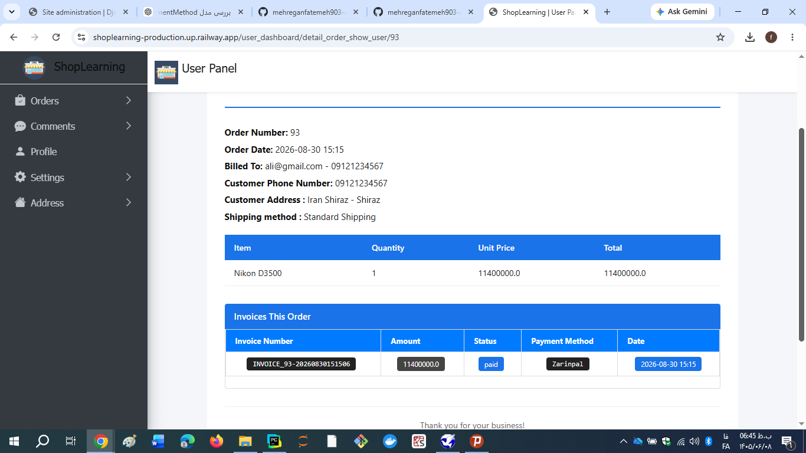

# ShopLearning 🛒

A production-ready Django e-commerce web application built with Python and Django, featuring authentication, product management, shopping cart, checkout, payment integration, invoice generation, admin and user dashboards, and SEO configuration.

**Live Demo:** https://shoplearning-production.up.railway.app/

**GitHub:** https://github.com/mehreganfatemeh903-arch/ShopLearning

---

## 🚀 Project Overview

ShopLearning is a full-featured e-commerce platform developed with Django.

The project covers the complete shopping workflow:

**Product → Cart → Checkout → Payment → Order → Invoice → Invoice Printing**

The application has been tested in a production environment on Railway.

---

## ✨ Features

### 👤 Authentication & Users

* User registration and login
* User authentication
* Password reset
* User dashboard
* User profile and address management

### 🛍️ E-commerce

* Product listing
* Product categories
* Product detail pages
* Product images
* Product stock management
* Shopping cart
* Cart quantity management
* Product discounts
* Coupon system
* Banner management

### 💳 Checkout & Payment

* Checkout form
* Shipping method selection
* Payment method selection
* Zarinpal payment integration
* Sandbox payment testing
* Transaction management
* Payment verification
* Automatic stock reduction after successful payment

### 📦 Orders & Invoices

* Order management
* Invoice generation
* Payment status tracking
* Order status management
* Printable invoices

### 👨‍💼 Admin

* Admin dashboard
* Product management
* Order management
* User management
* Payment management
* Site settings
* Banner management
* Contact management

### 🔎 SEO

* Dynamic sitemap
* `robots.txt`
* Production HTTPS URLs
* Search-engine-friendly public URLs
* Private/admin routes excluded from crawling

---

## 🧪 Production Testing

The application has been tested on the deployed Railway environment.

Verified workflow:

* ✅ Website accessibility
* ✅ HTTPS
* ✅ User login
* ✅ Product browsing
* ✅ Add to cart
* ✅ Checkout
* ✅ Payment Sandbox
* ✅ Order creation
* ✅ Invoice generation
* ✅ Invoice printing
* ✅ Product stock handling
* ✅ `robots.txt`
* ✅ `sitemap.xml`
* ✅ Production HTTPS URLs

---

## 🛠️ Technologies

* **Python 3**
* **Django 6**
* **SQLite**
* **HTML5**
* **CSS3**
* **JavaScript**
* **Bootstrap 5**
* **Bootstrap Icons**
* **Pillow**
* **Gunicorn**
* **Railway**

---

## 📁 Project Structure

```text
ShopLearning/
├── Myproject/
│   ├── settings.py
│   ├── urls.py
│   ├── seo.py
│   └── wsgi.py
│
├── store/
├── users/
├── payment/
├── admin_dashboard/
├── user_dashboard/
├── setting/
├── static/
├── templates/
├── media/
├── manage.py
├── requirements.txt
├── README.md
└── .gitignore
```

---

## ⚙️ Local Installation

Clone the repository:

```bash
git clone https://github.com/mehreganfatemeh903-arch/ShopLearning.git
cd ShopLearning
```

Create a virtual environment:

```bash
python -m venv .venv
```

Activate it on Windows:

```powershell
.venv\Scripts\Activate.ps1
```

Install dependencies:

```bash
pip install -r requirements.txt
```

Run migrations:

```bash
python manage.py migrate
```

Create an admin user:

```bash
python manage.py createsuperuser
```

Run the development server:

```bash
python manage.py runserver
```

Open:

```text
http://127.0.0.1:8000/
```

---

## 🔐 Environment Variables

For production, sensitive configuration should be supplied through environment variables.

Example:

```env
MERCHANT=your_zarinpal_merchant_id
```

Do not commit secrets or production credentials to GitHub.

---

## 🌐 Production

The project is deployed on Railway using Gunicorn.

Production URL:

```text
https://shoplearning-production.up.railway.app/
```

SEO endpoints:

```text
https://shoplearning-production.up.railway.app/robots.txt
https://shoplearning-production.up.railway.app/sitemap.xml
```

---

## 💳 Payment

The payment system is implemented using a gateway abstraction that supports multiple payment providers.

Currently configured payment flow:

```text
Checkout
   ↓
Create Order
   ↓
Create Transaction
   ↓
Zarinpal
   ↓
Payment Verification
   ↓
Update Transaction
   ↓
Update Invoice
   ↓
Update Order
   ↓
Reduce Product Stock
   ↓
Complete Purchase
```

Zarinpal Sandbox is used for testing.

---

## 📄 Invoice Workflow

After a successful payment:

1. The transaction is verified.
2. The invoice is marked as paid.
3. The order is marked as paid.
4. Product stock is updated.
5. The cart is cleared.
6. The invoice can be viewed and printed.

---

## 🔎 SEO Endpoints

### robots.txt

```text
https://shoplearning-production.up.railway.app/robots.txt
```

### Sitemap

```text
https://shoplearning-production.up.railway.app/sitemap.xml
```

Private sections such as admin, dashboard, and payment routes are excluded from crawling.

---

## 📸 Screenshots

### 🏠 Home Page



### 🛍️ Products



### 📦 Product Details



### ⭐ Product Reviews



### 🛒 Shopping Cart



### 💳 Checkout



### ✅ Payment Successful



### 🧾 Invoice



---

## 🎯 Future Improvements

Possible future improvements include:

* PostgreSQL for production database
* Real production payment credentials
* Email notifications
* Advanced product search
* Product reviews and ratings
* Order tracking
* Automated CI/CD testing
* Docker deployment
* Advanced analytics dashboard

---

## 👩‍💻 Developer

**Fatemeh Mehregan**

Computer Engineering / Information Technology

Interested in Python, Django, Artificial Intelligence, Machine Learning, and Web Development.

---

## 📌 Project Status

**Production Ready**

The current production version has been tested end-to-end on Railway.

**Status:** ✅ Stable
